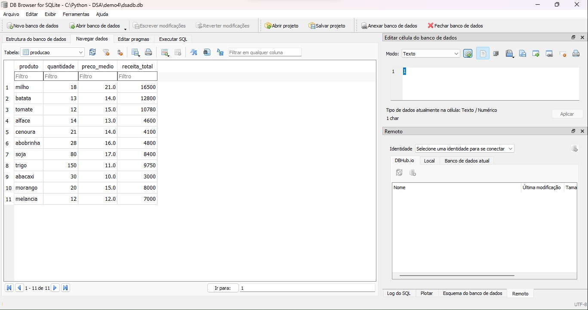
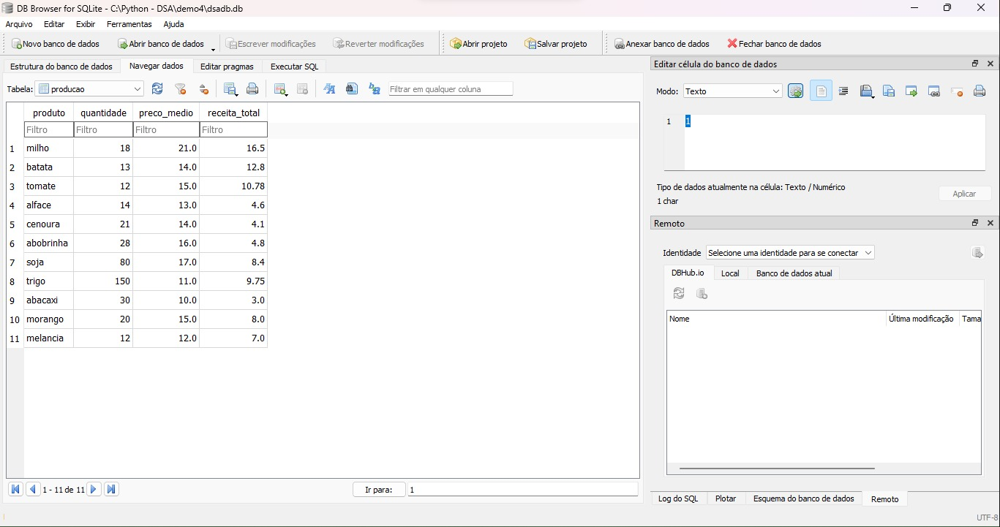
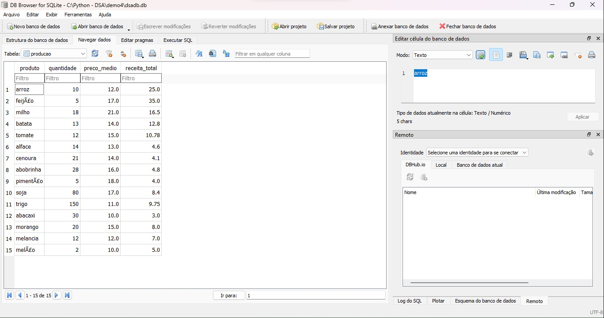
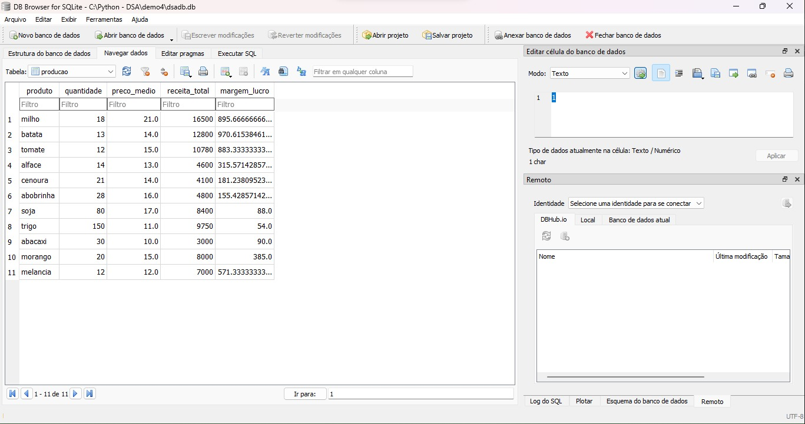
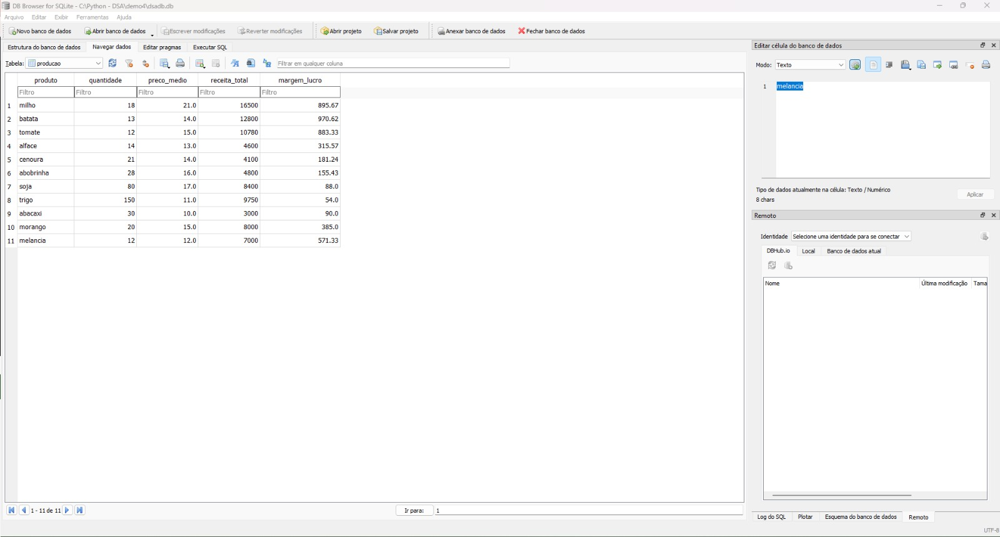

# Pipeline ETL em Python
Este repositório apresenta um modelo prático e simples de Pipeline ETL em Python, o qual será enriquecido com jobs incorporando transformações alinhadas às regras de negócio estabelecidas. O foco aqui é demonstrar desde a extração de dados de um arquivo CSV até a criação de um banco de dados SQLite, complementado por diversos processos de transformação utilizando a linguagem Python.

## Instruções de Uso:
Pré-requisitos ferramentas:

* Python - versão 3.9
* Editor de textos - Notepad++ versão v8.5.6
* SQlite - https://sqlitebrowser.org/dl/

### 1 - Extração e Criação do Banco de Dados

Execute o arquivo `job_v1.py` para criar o banco de dados SQLite e extrair os dados do arquivo CSV.

Este job criará a tabela "produtos" no banco de dados SQLite e carregará os dados do arquivo CSV para a tabela.

 

### 2 - Filtro de Dados
Execute o arquivo `job_v2.py` para aplicar um filtro nos registros, mantendo apenas aqueles com quantidade produzida superior a 10.

Este job removerá os registros que não atendem ao critério de quantidade > 10 da tabela "produtos".

 

### 3 - Limpeza de Dados
Execute o arquivo `job_v3.py` para remover o caractere "ponto" na última coluna do arquivo, evitando truncamento de números.

Este job atualizará a coluna de preços na tabela "produtos" para remover os pontos, facilitando cálculos futuros.

 

### 4 - Enriquecimento de Dados
Execute o arquivo `job_v4.py` para enriquecer os dados adicionando uma coluna chamada "margem de lucro" para cada produto.

Este job adicionará uma nova coluna na tabela "produtos" e calculará a margem de lucro para cada produto com base no preço.

 

### 5 - Arredondamento de Valores
Execute o arquivo `job_v5.py` para parametrizar os valores com arredondamento.

Este job ajustará os valores da coluna "margem de lucro" para conter apenas duas casas decimais.

 

## Conclusão

Através de imagens ilustrativas, o projeto oferece uma visão mais tangível de cada etapa do processo. Do carregamento inicial dos dados, limpeza, criação de colunas enriquecidas e do ajuste de valores, essas imagens proporcionam uma compreensão visual instantânea das operações realizadas.

Em resumo, este Pipeline ETL em Python não só apresenta uma abordagem eficiente para o tratamento de dados, mas também demonstra como as ferramentas e estratégias adotadas podem ser fundamentais para a obtenção de informações confiáveis, aprimoramento da tomada de decisões e criação de um fluxo de trabalho mais eficaz e otimizado no ambiente empresarial.

 
